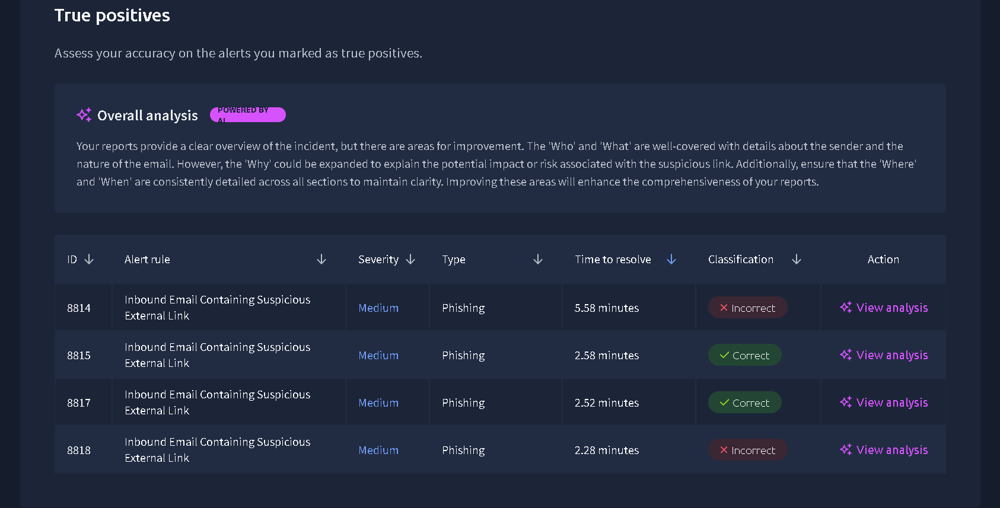
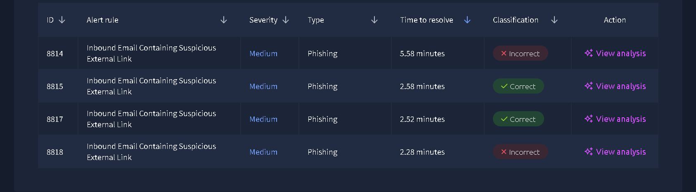
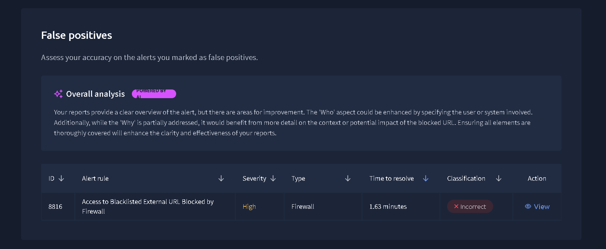

# Case 01 – Phishing Incident Triage

## Overview

This investigation documents the analysis of phishing alerts generated during a SOC simulation.

The objective was to review multiple email alerts, identify malicious activity, classify alerts correctly, and improve phishing investigation skills.

---

## Investigation Details

**Platform:** TryHackMe SOC Simulator

**Category:** Phishing Investigation

**Severity:** Medium

**Status:** Completed

---

## Table of Contents

- Overview
- Investigation Details
- Objectives
- Scenario
- Alert Information
- Investigation Results
- Investigation Process
- Evidence
- Findings
- Recommendations
- Lessons Learned
- 

## Investigation Objectives

- Investigate inbound phishing alerts.
- Identify malicious emails.
- Distinguish True Positives from False Positives.
- Improve alert triage and reporting skills.

---

## Scenario

This investigation was performed using the TryHackMe SOC Simulator.

The simulation presented multiple security alerts, including phishing email alerts and a firewall alert. Each alert was reviewed, investigated, and classified based on the available evidence.

---

| Field | Value |
|-------|-------|
| Alert Rule | Multiple Security Alerts |
| Categories | Phishing, Firewall |
| Severity | Medium / High |
| Platform | TryHackMe SOC Simulator |
| Alerts Reviewed | 5 |
| Phishing Alerts | 4 |
| Firewall Alerts | 1 |

---

## Investigation Results

| Metric | Result |
|---------|--------|
| Alerts Reviewed | 5 |
| Correct Classifications | 3 |
| Incorrect Classifications | 2 |
| True Positive Rate | 67% |
| Mean Time to Resolve | 3 Minutes |
| Mean Dwell Time | 8 Minutes |

---

## Investigation Process

The investigation followed a structured SOC triage methodology.

### Step 1 – Alert Review

- Reviewed each alert generated by the SOC Simulator.
- Identified the alert rule, severity, and alert type.

### Step 2 – Email Analysis

- Examined sender information.
- Reviewed embedded URLs.
- Looked for phishing indicators.

### Step 3 – Classification

Each alert was analyzed and classified as either:

- True Positive
- False Positive

based on the available evidence.

### Step 4 – Documentation

Recorded investigation findings and submitted an incident report for each alert.

---

## Evidence

### AI Overall Analysis

The SOC Simulator provided AI-generated feedback on the investigation report.

---

### Alert Classification Results

The following screenshot shows the alert classification summary after completing the phishing investigation.

### Firewall Alert Analysis

One firewall alert was investigated during the SOC simulation.

The alert indicated access to a blacklisted external URL that was blocked by the firewall.

This alert was incorrectly classified during the investigation, highlighting the importance of validating firewall events before closing an incident.

### SOC Performance Summary

The SOC Simulator generated a performance summary after completing the investigation. The dashboard provides an overview of investigation efficiency and accuracy.

**Key Metrics**

- Alerts Closed: **5**
- Mean Time to Resolve (MTTR): **3 minutes**
- Mean Dwell Time: **8 minutes**
- True Positive Identification Rate: **67%**

## Findings

During the investigation:

- Multiple phishing email alerts were analyzed.
- Some phishing emails were correctly identified.
- A few alerts were incorrectly classified, highlighting areas for improvement.
- The investigation emphasized the importance of validating evidence before making decisions.

  ## Recommendations

- Verify sender reputation before closing alerts.
- Analyze embedded URLs carefully.
- Review email headers when available.
- Continue practicing phishing investigations to improve detection accuracy.

## Lessons Learned

- Validate all available evidence before classifying an alert.
- Analyze sender information, URLs, and email content carefully.
- Review firewall alerts with the same attention as phishing alerts.
- Avoid making assumptions during incident triage.
- Improve reporting by clearly documenting the Who, What, When, Where, Why, and Impact of each incident.
